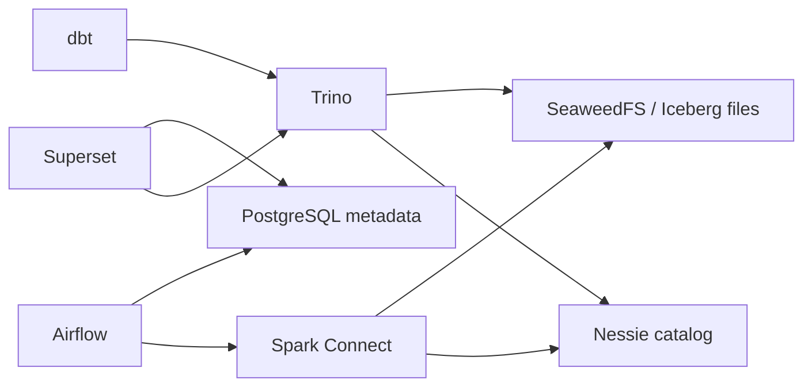

# Farol local lakehouse

V1 scope: public expenses. See the [lakehouse implementation plan](docs/despesas-v1-plan.md)
and [42-capability checklist](docs/despesas-v1-capabilities.md).

Based on `lab-lakehouse-oss`: SeaweedFS 3.97 (S3), Nessie 0.104.2,
Iceberg 1.9.2, Spark Connect 3.5.6, Trino 476, Airflow 3.1.0,
PostgreSQL 17 metadata, dbt and Superset 5.0.0. Versions match the reference.



The Compose project, network, images and volumes are separate from the reference lab.
The expense pipeline is implemented for the explicit pilot partitions in
[conf/despesas.yml](conf/despesas.yml). It includes immutable raw evidence, Iceberg bronze,
typed silver facts, tested/versioned gold releases, operational tracking and Superset dashboards.
The [expense runbook](docs/runbooks/despesas-v1.md) explains coverage and recovery.
This is a bounded pilot, not complete implementation or nationwide coverage of all 42 capabilities.
Only the Transparência API key is forwarded to the Airflow service. Local Airflow tasks share
that service environment; credentials are not isolated into separate worker containers.

## Start on Windows

Start Docker Desktop with Linux containers. Allow about 10 GB RAM for Docker
(service limits total approximately 7.5 GiB, plus build/runtime overhead).
Run these commands from this repository in PowerShell:

```powershell
# Keep your existing .env. Only copy the example for a new checkout without one.
if (!(Test-Path .env)) { Copy-Item .env.example .env }
docker compose config --quiet
docker compose up -d --build --wait --wait-timeout 600
docker compose exec airflow python -m farol.bootstrap
.\scripts\despesas.ps1 -Action test
.\scripts\despesas.ps1 -Action run
```

The bootstrap creates bronze/silver/gold namespaces and writes a temporary Iceberg
table through Spark, reads it through Trino, then drops it. `despesas.ps1 -Action run`
ingests configured government-data partitions and builds a new `gold_r...` release;
the current release is reported by `despesas.ps1 -Action status`. Models materialize as
tables because Trino's Nessie connector does not support creating views.
The `farol_local` DAG remains an infrastructure-only smoke check. The manual `despesas_v1`
DAG runs ingestion, transformation/tests and dashboard publication. Both schedules remain off.

| Service | Local address | Access |
|---|---|---|
| Airflow | http://127.0.0.1:18081 | Local SimpleAuth all-admin mode |
| Superset | http://127.0.0.1:18088 | admin / `SUPERSET_ADMIN_PASSWORD` (default admin) |
| Trino | http://127.0.0.1:18080 | User farol; no password |
| Nessie | http://127.0.0.1:29120/api/v2 | Catalog API |
| S3 | http://127.0.0.1:18333 | Credentials in `.env.example` / Compose defaults |
| Spark Connect | sc://127.0.0.1:25002 | Spark client |

Superset automatically registers the `Farol` Trino connection using `trino://farol@trino:8080/lake`.
The expense publication command creates a versioned dashboard and executes all chart queries.
Production authentication is not configured. Services bind to
loopback; these development defaults are intended only for your local machine.

Host ports can be changed in `.env`; containers use internal service names and ports.
Keep infrastructure passwords URL-safe because metadata connection URIs embed them.
The reference's dbt environment and Great Expectations tooling are installed in Airflow;
expense models use Python contract gates and dbt tests. Further adapters and financial
contracts remain tracked by the coverage mart; Great Expectations is not yet wired to this pipeline.

```powershell
docker compose ps
docker compose logs --tail 100
docker compose down  # stops Farol, keeps persisted data
```

Avoid `down -v` unless you intend to erase Farol's persisted storage and metadata.
Optional host Python development: `uv sync` (Python 3.11+); Docker provides the Python
runtime needed for the commands above. The API audit scripts remain in `scripts/`.
