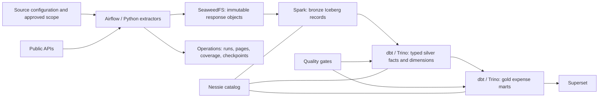

# Farol v1 — public expenses lakehouse plan

Status: partially implemented as a bounded pilot, 2026-10-06. Scope authority: [despesas.yaml](despesas.yaml).
Tracking: [42-capability checklist](despesas-v1-capabilities.md), including declared required inputs.
Expense ingestion, operational tracking, selected source financial contracts, silver/gold tables,
tests and versioned Superset dashboard publication are implemented. See the
[runbook](runbooks/despesas-v1.md) for operating commands and limitations. The remaining scope below
is the target design, not a claim of completed implementation. Transparência credentials were
successfully validated without changing `.env`.

## Outcome and scope

Deliver a local, traceable explorer of public expenditure: what was committed (empenhado),
liquidated (liquidado), paid (pago), reimbursed, or reported in fiscal statements, with source,
period, geographic coverage and limitations visible beside every metric.

All 10 sources / 42 catalog tools remain in v1 scope. Tools are query capabilities, not necessarily
42 distinct endpoints or tables. Implement shared extractors where calls overlap.

Include federal execution, expense documents/items, corporate cards, official travel, amendment
execution, Câmara CEAP, SICONFI RREO/RGF/DCA, municipal expense sources, contract commitments/invoices,
and RS fiscal/education/health indicators. Exclude revenues, procurement as a standalone product,
individual payroll, benefits, tax waivers, electoral spending, Senate CEAPS and the catalog's v2 items.
Contracts and procurement identifiers are supporting links only.

Proposed initial coverage: 2025 and 2026 year-to-date. First end-to-end development slice:
one deputy and one month of CEAP; then one federal organization/month and one SP municipality/month.
Select IDs from validated lookups and record them in configuration. Expand only after measuring
page counts and source limits. Historical COVID endpoints stay in scope but require separately
configured historical periods; never query them only for 2025–2026 and infer absence.

## Architecture and ownership



- Python extractors handle HTTP, authentication, pagination and raw-response persistence. No large
  payloads in Airflow XCom; pass object keys and batch IDs only.
- Spark handles bronze parsing and Iceberg writes; it does not perform one HTTP request per Spark row.
- dbt/Trino owns silver normalization and gold transformations. Use tables/incremental tables:
  this tested Nessie connector does not support Trino view creation.
- Nessie `main` is the local catalog branch. Do not claim atomic publication across multiple dbt
  tables. Use successful-batch tracking and publish marts only after their upstream checks pass;
  retain the last successful release on extraction failure. Validate any future branch promotion separately.
- Add a separate `farol_ops` database in the existing PostgreSQL service for operational state.
  Do not write pipeline tables into Airflow's internal schema. Provide an idempotent migration
  command: changing the Postgres initialization SQL alone does not update existing volumes.
- Give only source-extraction tasks the required credentials; never log authorization headers,
  tokens, credential-bearing URLs, or entire environment variables.

## Source rollout and readiness gates

| Order | Source | Tools | First deliverable | Required gate before ingestion |
|---|---|---:|---|---|
| 1 | Câmara | 3 | CEAP reimbursement explorer | Real deputy expense route, full pagination, receipt/reimbursement semantics |
| 2 | Transparência | 14 | Federal execution by organization/function, then documents and thematic spending | Authenticated calls with configured key; filters, keys, monetary semantics and page limits |
| 3 | TCE-SP | 2 | Municipal expense explorer | Complete payload for selected municipality/month; document grain and cancellation semantics |
| 4 | SICONFI | 7 | Fiscal statements and comparable execution indicators | RREO/RGF/DCA query contracts, submission versions, annex/account mappings and units |
| 5 | Compras | 3 | Contract commitment and invoice drill-down | Discover actual contract IDs via unit lookup; verify child routes and links to CGU |
| 6 | TCE-PI | 3 | Municipal expense details | Resolve parameterized expense route; distinguish totals from detailed records |
| 7 | TCE-RN | 2 | Municipal execution | Resolve route and jurisdiction/year parameters |
| 8 | TCE-PE | 2 | Municipal execution | Validate the concrete routes in despesas.yaml, not just its documentation page |
| 9 | TCE-CE | 2 | Municipal commitments | Resolve catalog routes that previously returned 404 |
| 10 | TCE-RS | 4 | LRF/MDE/ASPS indicators | Discover accessible catalog resources and verify amount/percentage definitions |

This is delivery order, not a reduction of scope. An unavailable source remains visibly blocked
with evidence, owner action and retry date. A partial pilot may ship with explicit coverage;
it must not be called completion of all v1 sources. Prior source-level successes do not certify
expense capabilities, and old unauthenticated 401s do not mean the supplied keys are invalid.

## Raw and bronze

Raw object layout:

`s3://warehouse/raw/{source}/{resource}/extracted_date=YYYY-MM-DD/{run_id}/{request_hash}/{page}.json.gz`

Use opaque page IDs for cursors; never embed credentials or individual CPF values in object paths.
Preserve original response bytes, including non-JSON errors in a separate failed-response area.
Record status/content type, safe request parameters, extraction timestamps, SHA-256, body bytes,
record count if parsable, pagination metadata and request duration. An HTTP 200 containing HTML
or an application error is not a successful data page.

Bronze tables are per resource, e.g. `bronze.camara_despesas`, `bronze.cgu_documentos_despesa`,
`bronze.tce_sp_despesas`, `bronze.siconfi_rreo`. Keep original record JSON plus:
`source`, `resource`, `run_id`, `request_hash`, `raw_object_key`, `record_hash`,
`extracted_at`, `source_updated_at` when available, `schema_version`, and `coverage_partition`.
Do not infer source update time from retrieval time. Use append-only observations and deduplicate
identical request retries within a logical run; preserve later source revisions.

Partition raw/bronze by extraction date at modest scale. Partition large typed expense facts by
reference year/month only after measured volumes justify it. Avoid tiny tables/partitions per deputy
or municipality. Start with a provisional 128 MiB compacted-file target and tune from real batches.

## Silver contracts and grains

| Model family | Grain | Monetary meaning |
|---|---|---|
| `fct_execucao_documento` | Source + entity + fiscal year + document/event identity + revision | An execution event, or explicitly marked cumulative document snapshot |
| `fct_item_empenho` | Source commitment document + item identity | Commitment item; not an additional amount to add to its parent |
| `fct_execucao_agregada` | Source + entity + period + full classification axes + measure basis | Published totals; never unioned with detailed transactions |
| `fct_ceap_reembolso` | Deputy + source document + reimbursement installment/identity | Reimbursement, retaining gross amount and deductions separately |
| `fct_cartao_transacao` | Source transaction identity | Card transaction with reversals and refunds preserved |
| `fct_viagem` / `fct_viagem_componente` | Trip / trip expense component | Published trip total or validated components; no sum of both |
| `fct_emenda_execucao` / bridge to documents | Amendment + source execution grain / amendment-document link | Amendment execution with link cardinality validated before aggregation |
| `fct_contrato_empenho`, `fct_contrato_fatura` | Contract + source commitment/invoice identity | Invoice issuance is not proof of payment; may overlap CGU records |
| `fct_demonstrativo_fiscal` | Entity + year + statement + period + annex + account + column + scope + revision | Reported statement cell with unit and accumulated/period basis |
| `fct_indicador_fiscal` | Entity + reference period + indicator + source revision | Amount or percentage, retaining denominator when published |

Final natural keys must be confirmed from live payloads. Where IDs are absent, document a stable
composite key and collision checks; retain the source observation when uniqueness is unresolved.
No silent deduplication based only on amount/date/payee.

Shared fields where applicable: `source`, `source_record_id`, `entity_id`, `government_level`,
`fiscal_year`, `reference_period`, `event_date`, `expense_stage`, `amount`, `currency`,
`measure_basis`, `document_id`, `source_url`, `raw_object_key`, `batch_id`, `extracted_at`.
Use decimal monetary types (proposed `DECIMAL(20,2)` for BRL) and preserve original text/precision.
Keep document/organization codes as strings. Missing values remain null; missing coverage is not zero.

Dimensions: calendar/reporting period, federative entity, organization/unit, expense classification,
deputy, amendment and supplier. Crosswalk IBGE, SIAFI, SIAPE and each TCE's identifiers explicitly;
same-looking IDs or names do not establish equivalence. Retain effective dates on changing mappings.
Default gold supplier identity to companies/CNPJ; mask individual identifiers and exclude personal
contact details. Raw access stays restricted to local ingestion/processing services.

## Financial aggregation rules

1. Show empenhado, liquidado and pago as separate measures. Never add the three into total spending.
2. Distinguish movements from cumulative snapshots. Choose the latest applicable snapshot;
   do not sum successive monthly cumulative balances.
3. Preserve estornos, refunds and negative adjustments. Do not enforce universal positive amounts
   or unconditional `pago <= liquidado <= empenhado` constraints across differing periods/bases.
4. Keep fiscal-year execution and restos a pagar identifiable where sources provide that distinction.
5. CGU detail, aggregate totals, contract-linked records, card/travel data and amendments may overlap.
   Publish separate analytical perspectives; join via validated keys rather than unioning amounts.
6. SICONFI is a reported aggregate fallback, not reconstructed transaction detail. It cannot fill
   missing municipal suppliers or commitments. Compare it with TCE totals only on matched definitions.
7. MDE/ASPS and other ratios are non-additive. Do not sum percentages or average them without a
   validated weighting denominator.

## Gold and user questions

| Gold mart | Answers | Display requirements |
|---|---|---|
| `mart_execucao_orgao_periodo` | Organization spending by period and stage | Source, classification coverage, stage, movement/snapshot basis |
| `mart_execucao_funcao_periodo` | Health/education expenditure | Function mappings and comparable accounting basis |
| `mart_pagamentos_fornecedor` | Documented payments to a company | Only proven payment events; source drill-down and overlap exclusions |
| `mart_ceap_deputado_mes` | Deputy reimbursements | Gross/deductions/reimbursed measures and receipt references |
| `mart_cartoes`, `mart_viagens`, `mart_emendas` | Thematic federal expenditure | Separate totals and explicit links to execution records |
| `mart_execucao_municipal` | Municipal expenditure | UF/entity, source, coverage and stage; detailed vs reported clearly marked |
| `mart_demonstrativos_fiscais` | Fiscal statement comparison | Statement/annex/account/period/unit/revision filters |
| `mart_indicadores_rs` | Published fiscal/education/health indicators | Definition, numerator/denominator if available, reference period |
| `mart_contrato_execucao` | Commitments and invoices linked to contracts | Invoice/payment distinction and linkage provenance |
| `mart_cobertura_fontes` | What data can be trusted for this selection? | Requested/completed partitions, freshness, missing pages, quality status |

Initial Superset delivery: coverage dashboard, CEAP dashboard, federal execution dashboard,
then municipal and fiscal comparison dashboards. Every metric must have provenance and reference
period. No single cross-source nationwide “total spent” in v1 without a proven disjoint universe.

## Ingestion state, updates and schedules

- Configure adapters with endpoint templates, parameter mappings, authentication references,
  timeouts, response schemas, source keys, pagination termination and per-host rate budgets.
- Operational tables: `ingestion_run`, `request_page`, `coverage_partition`, `checkpoint`,
  `schema_observation`, `quality_result`, `publication`. They distinguish attempted, complete,
  failed, quarantined and published batches and count both bytes and records.
- Commit a checkpoint only after all expected pages are durably stored and validated. Resume a
  failed page without advancing the partition. Detect repeating cursors/pages and maximum-page caps;
  reaching a cap is incomplete, not successful. Respect Retry-After and bounded retry/backoff.
- Begin with one request in flight per source and one Spark ingestion task on the local stack.
  Tune request rates from verified provider rules; do not treat catalog rate limits as current proof.
- Provisional schedules: daily transactional refresh, weekly lookups and fiscal reports, weekly
  90-day revision sweep and monthly current/prior-fiscal-year reconciliation. If there is no reliable
  update filter, refetch configured partitions. Adjust windows after observing source revisions.
- Backfills are manual, parameterized and bounded. Normal schedules start paused until scope and
  volume estimates are recorded. Avoid automatically querying every municipality/deputy/year.
- Load estimates come from bounded pilots: pages × mean body bytes, total records, observed
  compression and elapsed time. Include raw + Iceberg + revision/snapshot storage separately.
  Record uncertainty; the earlier source-audit payload bytes are not full ingestion sizes.
- Retention and Iceberg expiration remain disabled initially. Measure local disk growth and agree
  on retention before any cleanup task deletes raw evidence or historical snapshots.

## Quality and publication gates

Contract checks: valid HTTP/auth, data content type, required query semantics, pagination completion,
stable keys, date/decimal parsing, empty-vs-error responses, nested collections and schema drift.
Additive optional fields are preserved and reported; incompatible key/type/meaning changes quarantine
the batch. Preserve the previously published data with a stale status rather than replacing it with zero.

Financial checks: duplicates at declared grain, join fan-out, unknown entity mappings, valid measure
basis, revisions and cancellations. Reconcile like-for-like published totals when available; document
the tolerance and rounding rule per source. Unexplained differences block the affected mart, not all
other sources. Record quality outcomes and unmatched rows for investigation.

Tests: adapter fixtures for auth errors, pagination loops, schema drift, malformed money and partial
failure; restart/idempotency tests; dbt uniqueness/not-null/relationship checks appropriate to each
grain; a bounded opt-in live smoke per implemented core capability. CI must not need real API keys.

## Milestones and acceptance

| Milestone | Deliverable | Exit criterion |
|---|---|---|
| M0 — contracts | Generated 42-tool inventory, authenticated evidence, query examples, scope/cost configuration | Every tool mapped to an adapter or explicit blocker; credential values absent from artifacts |
| M1 — CEAP slice | Raw → bronze → silver → gold → Superset for one deputy/month | Full pages, valid grain, lineage, quality results; rerun produces no duplicate logical facts |
| M2 — federal execution | CGU organization/function totals and documents; card/travel/amendment branches | Parameterized ingestion and source-specific financial reconciliation; no overlapping totals |
| M3 — municipalities/fiscal | SP + SICONFI, then other TCE adapters | Explicit transaction vs statement semantics, complete configured partitions and blocked-source visibility |
| M4 — drill-down | Compras commitments/invoices and remaining scoped thematic/historical calls | Referential links validated; invoice/payment distinction enforced |
| M5 — v1 release | Expanded approved scope, dashboards, operations runbook | All scoped capabilities validated or release explicitly labeled partial; restart/replay/failure tests pass |

Each milestone includes tests, contracts and docs. Do not defer auditability to the last milestone.
No calendar estimate is assigned until M0 measures authenticated access and representative volumes.

## Proposed repository additions

```text
conf/despesas.yml                   # enabled resources, entity/year allowlists, refresh/rate budgets
src/farol/sources/                  # HTTP adapters, auth injection, parameter contracts
src/farol/ingestion/                # paging, raw writer, manifests, checkpoints
src/farol/bronze/                   # Spark parsing and bronze append
src/farol/ops/                      # database migrations and batch publication state
orchestration/dags/despesas_*.py    # lookup, ingest, reconcile and manual backfill workflows
dbt/models/silver/                  # typed source models, dimensions and crosswalks
dbt/models/gold/                    # marts above and coverage
dbt/tests/                         # grain, mapping and reconciliation checks
tests/                             # adapter fixtures, retry/replay and integration tests
docs/contracts/                    # verified keys, schemas, pagination, semantics and evidence
docs/runbooks/                     # backfill, source outage, schema change, recovery
```

First implementation task: M0, followed by the CEAP vertical slice. API keys are already configured;
no additional key request is a prerequisite to begin. Proposed time/entity limits above are defaults
for planning, not a claim that the configured source data has already been downloaded.
